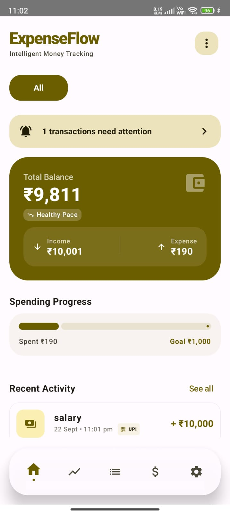
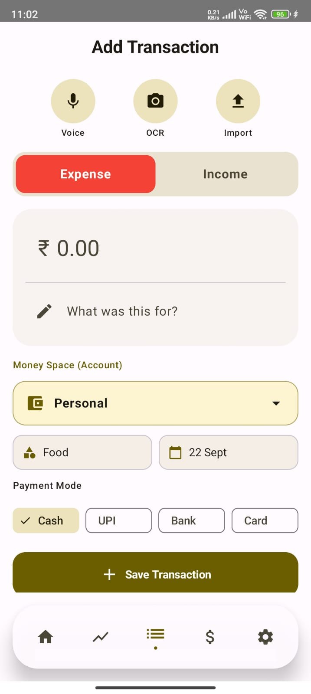
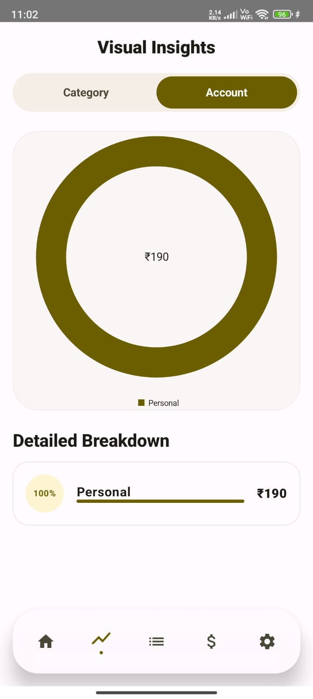
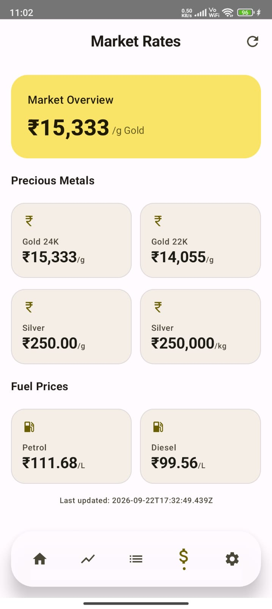
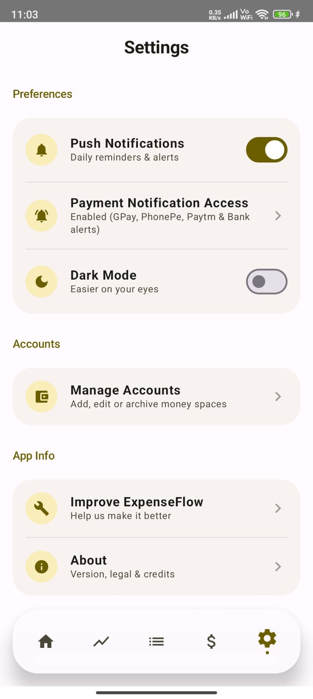

# 💰 ExpenseFlow

### Your expenses. Automatically tracked.

A privacy-focused Android expense tracker designed to make recording and understanding your finances easier — with **automatic payment notification detection**, smart reminders, transaction tools, visual insights, and live market & fuel rates.

<p align="center">

🤖 Automatic Detection • 🔔 Smart Reminders • 📊 Insights • 🪙 Live Rates • 🔐 Local-First

</p>

---

## 🎥 See ExpenseFlow in Action

**Make a payment. Get notified. Add it. Done.**

<p align="center">
  
</p>

### 💳 Pay → 🤖 Detect → 🔔 Notify → ➕ Confirm → 💾 Track

ExpenseFlow is designed to reduce the effort of manually recording every transaction.

---

# 🤖 Automatic Transaction Detection

## Stop remembering every transaction. Let ExpenseFlow help.

ExpenseFlow can detect supported payment notifications from services such as **Google Pay, PhonePe, Paytm, and bank alerts** and bring the transaction to your attention.

When a relevant payment notification is detected, ExpenseFlow can show a notification that allows you to add the transaction.

### ⚡ How it works

```text
       💳 Make a Payment
              ↓
       📱 Payment Alert
              ↓
      🤖 ExpenseFlow
        detects it
              ↓
       🔔 Notification
              ↓
       ➕ Add Transaction
              ↓
           💾 Saved
```

The goal is simple:

> **Detect → Notify → Confirm → Track**

---

## 🔔 What if you don't add it immediately?

Sometimes you see a notification and think:

> "I'll add it later."

And then forget. 😅

ExpenseFlow can keep the detected transaction as needing attention so you can return to it later.

Your Home screen can show transactions that still need your attention.

<p align="center">
  
</p>

---

# 🔐 Privacy First

Financial information is personal.

ExpenseFlow follows a **local-first approach** for personal transaction data.

The automatic transaction detection feature is designed to process relevant payment notification information on the device. Transaction records are stored locally using the app's local database.

The app does use external services where required for features such as live market and fuel rates.

**Your financial data should stay under your control.**

---

# 🏠 Your Financial Dashboard

ExpenseFlow gives you a quick overview of your finances from the Home screen.

### At a glance:

- 💰 Total balance
- 📥 Income
- 📤 Expenses
- 📈 Spending progress
- 🔔 Transactions needing attention
- 🧾 Recent activity

<p align="center">
  
</p>

---

# 💳 Flexible Transaction Entry

Need to add a transaction manually?

ExpenseFlow provides multiple ways to enter transaction information.

### Available options:

- 🎙️ Voice
- 📷 OCR
- 📥 Import
- 💸 Expense / Income
- 🏷️ Categories
- 💼 Money Spaces
- 📅 Custom dates
- 💵 Cash
- 📱 UPI
- 🏦 Bank
- 💳 Card

<p align="center">
  
</p>

---

# 🧮 Built-in Transaction Calculator

Sometimes you don't need another calculator.

ExpenseFlow lets you select transactions and calculate their combined amount directly from the transaction screen.

### Useful for:

- Adding multiple expenses
- Checking spending for a period
- Calculating a group of transactions
- Quickly reviewing selected expenses

```text
☑ Grocery          ₹450
☑ Fuel             ₹800
☑ Restaurant       ₹320
☑ Coffee           ₹120
────────────────────────
       Total      ₹1,690
```

**Select → Calculate → Done.**

---

# 📊 Visual Insights

Numbers tell you what happened.

Visualizations help you understand it.

ExpenseFlow provides visual breakdowns of your spending so you can see where your money is going.

### Insights include:

- 📊 Category-wise spending
- 💼 Account / Money Space breakdown
- 💰 Spending distribution
- 📈 Detailed category breakdown

<p align="center">
  
</p>

---

# 💼 Money Spaces

Not all money belongs to the same place.

ExpenseFlow lets you manage separate money spaces/accounts so different sources or purposes can be tracked independently.

For example:

```text
💰 Personal
🎉 Event Fund
🏠 Monthly Expenses
👨‍👩‍👧 Family
📦 Other
```

This helps keep different pools of money organized instead of mixing everything together.

---

# 🪙 Live Market & Fuel Rates

ExpenseFlow also provides a dedicated Market Rates section for commonly tracked prices.

### 🥇 Precious Metals

- Gold 24K
- Gold 22K
- Silver

### ⛽ Fuel

- Petrol
- Diesel

<p align="center">
  
</p>

Rates are displayed with their latest update time so you can see when the information was refreshed.

---

# 🔔 Smart Notifications

Notifications are an important part of ExpenseFlow's automation.

They can be used for:

- 🤖 Automatically detected transactions
- 🔔 Transactions needing attention
- 📢 Important app alerts
- ⏰ Reminders

The idea is to make expense tracking something that fits naturally into your daily workflow instead of another task you have to remember.

---

# ⚙️ Settings & Controls

ExpenseFlow provides controls for notifications, payment notification access, appearance, accounts, feedback, and app information.

<p align="center">
  
</p>

### Available controls include:

- 🔔 Push notifications
- 📱 Payment notification access
- 🌙 Dark mode
- 💼 Manage accounts
- 💬 Feedback
- ℹ️ About & app information

---

# 💬 Built-in Feedback

Have an idea?

Found a bug?

Want something changed?

ExpenseFlow includes a dedicated feedback section where users can share:

- 🐛 Bug reports
- 💡 Feature requests
- 💬 Suggestions
- ❤️ General feedback

Feedback helps shape future improvements to the application.

---

# 📱 App Structure

| Section | What it does |
|---|---|
| 🏠 **Home** | Financial overview & transactions needing attention |
| 📈 **Graph** | Visual spending analysis |
| 💳 **Transactions** | Add, manage & calculate transactions |
| 🪙 **Market Rates** | Gold, silver, petrol & diesel rates |
| ⚙️ **Settings** | Notifications, accounts, feedback & app controls |

---

# 🛠️ Tech Stack

### Android

- **Kotlin**
- **Jetpack Compose**
- **Room Database**
- **MVVM Architecture**
- **Kotlin Coroutines**
- **Material Design**

### Integrations & Android Features

- Local database storage
- Android notification system
- Payment notification detection
- OCR-based transaction entry
- Voice-based transaction entry
- Live market & fuel rate API integration

---

# 🏗️ Architecture

```text
                    ExpenseFlow
                        │
                        ▼
               Jetpack Compose UI
                        │
                        ▼
                    ViewModel
                        │
                        ▼
                   Repository
                        │
                        ▼
                  Room Database
                        │
                        ▼
                  Local Device
```

Automatic payment notification detection works alongside the application to identify relevant notifications and provide the user with an opportunity to record the transaction.

---

# 🚀 Future Improvements

ExpenseFlow is continuously evolving.

Possible future improvements include:

- 🤖 Smarter transaction detection
- 🏷️ Improved automatic categorization
- 💰 Advanced budgeting
- 📊 More financial insights
- 🔔 Improved notification controls
- 📈 Enhanced visualizations
- ⚙️ Additional customization

---

# ❤️ Built to Make Tracking Less of a Chore

Traditional expense tracking often depends on remembering to record every payment.

ExpenseFlow tries to reduce that friction.

> ### **Detect. Confirm. Track.**
>
> ### Spend less time recording your expenses.

---

## 👨‍💻 About

ExpenseFlow is an Android project built with **Kotlin and Jetpack Compose**.

Developed with the goal of making everyday expense tracking simpler, faster, and more automated.

---

## ⭐ Support

If you find ExpenseFlow interesting, consider giving the repository a ⭐.

Feedback, suggestions, and ideas are always welcome.

---

### 💰 ExpenseFlow

**Track smarter. Spend less time tracking.**
